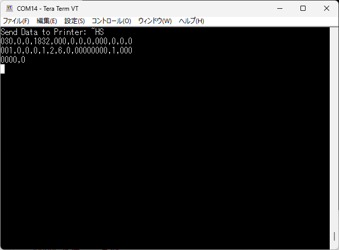

# Zebra-Printer_Guide to Communicate with Audrino via RS232C

# Link-OS プリンタとAudrino 間でシリアル通信する方法

2024/08/14


<br>

印刷処理のオートメーション化が進む中で、PLCやマイコンでZebra Link-OS プリンタを制御する方法についてのお問い合わせが2023年下旬から増加している。本頁では産業用機器との連携方法を説明するにあたって、入手が容易な汎用マイコン（Arduino）を用いている。通信方式の中で最も基本的でお問い合わせの多い、シリアルデータ送受信する方法について説明をする。

**尚、ゼブラプリンタの設定方法やAudrinoの使用方法の詳細については冗長的になるため、割愛する。不明時は下記の参考資料リンクや各種マニュアルを参照すること。**

<br>

#### 最低限必要なもの

1. Zebra Link-OS プリンタ（シリアル I/F必須）
2. Arduino UNO *
3. MAX232
4. RS232C ストレートケーブル（オス-オス）
5. その他（結線用ケーブル、ブレッドボード、基盤など状況に合わせて用意）

<br>

※ プリンタ以外はAmazon、秋月電気、千石電商などの電子専門店で入手が可能。

<br>

#### ガイド

1. Arduino とMAX232を結線する。本頁では下記結線を前提に説明を進める。

   | Arduino Uno                      | **MAX232 Module** |
   | -------------------------------- | ----------------------- |
   | Pin 7 (software selected TX pin) | TX pin                  |
   | Pin 6 (software selected RX pin) | RX Pin                  |
   | 5V pin of Arduino                | Vcc                     |
   | Ground pin of Arduino            | Ground Pin              |


   <br>

   結線方法は下記リンクを参考にすると良いと思われる。[How to interface Arduino with RS232 communication protocol: Example Code Included](https://embeddedthere.com/how-to-interface-arduino-with-rs232-communication-protocol/)

   <br>
2. プリンタとMAX232をシリアルケーブルで接続する。
3. プリンタのbaud rateを設定する。本項では9600で説明を進める。
4. 下記コードをArduinoにインストールする。

   下記プログラムの概要は下記の通り。

   | データフロー               | 通信   | 機能                      |
   | -------------------------- | ------ | ------------------------- |
   | Arduino --> Zebra Printer  | RS232C | Host Statusコマンドを送信 |
   | Zebra Printer -->  Arduino | RS232C | Host Status 結果を受信    |


   <br>

   ```c++
   #include <SoftwareSerial.h>

   #define rxPin 6
   #define txPin 7

   // Set up a new SoftwareSerial object
   SoftwareSerial mySerial =  SoftwareSerial(rxPin, txPin);

   void setup()  {
       // Define pin modes for TX and RX
       pinMode(rxPin, INPUT);
       pinMode(txPin, OUTPUT);

       // Set the baud rate for the InternalSerial object
       Serial.begin(9600);
       // Set the baud rate for the SoftwareSerial object
       mySerial.begin(9600);

       // Send Data to ZPL printer
       String zpl01 = "^XA^FO50,50^A0N,50,50^FDHELLO^FS^XZ";
       String zpl02 = "~HS";
       String sgd01 = "! U1 getvar \"rfid\"";

       // Send String to MySerial
       Serial.println("Send Data to Printer: " + zpl02);
       writeStringToMySerial(zpl02);

   }

   void loop() {

       // mySerialに受信したデータをシリアル表示
       if (mySerial.available() > 0) {

       // 文字コード(int)を出力する場合
       //Serial.println(mySerial.read());

       // Ascii文字コードに対応したCharを出力する場合
       char c = mySerial.read();
       Serial.print(c);
       }
   }

   // Send String to MySerial
   // Serial.writeはStringの送信をサポートしていないため、char or int(Ascii)で送信する
   void writeStringToMySerial(String stringData){

   for (int i = 0; i < stringData.length(); i++)
   {
       mySerial.write(stringData[i]);   // Push each char 1 by 1 on each loop pass
   }

   // Send CRLF for end of SGD command
   mySerial.write(13);
   mySerial.write(10);


   }// end writeString
   ```

   <br>

   ##### 受信データ例

   

<br>

#### 参考資料リンク

- [PLC開発者必見。ゼブラプリンタの電文構造の説明](https://github.com/shimauma-giken/Zebra-Printer-Data-Structure-Explained-for-PLC-Programmers)
- [How to interface Arduino with RS232 communication protocol: Example Code Included](https://embeddedthere.com/how-to-interface-arduino-with-rs232-communication-protocol/)
- [Fundamentals of RS232 Communication Protocol: Working Principle and Applications](https://embeddedthere.com/introduction-to-rs232-serial-communication-protocol-fundamentals-operation-and-specifications/)
- [SoftwareSerial Library - Arduino](https://docs.arduino.cc/learn/built-in-libraries/software-serial/)
- [MAX232 - Wikipedia](https://en.wikipedia.org/wiki/MAX232)

<br>
<br>
Enjoy Zebra!!
<br>
